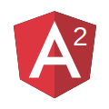

:revealjs_mouseWheel: true
:revealjs_history: true
= Angular 101 ou 1TO2
Charles de MAGNEVAL <charles.de_magneval@open-groupe.com>
v1.0, 2016-01-10
:toc:
:homepage: https://github.com/magneval/

== Angular JS 1
image::images/angular-logo.svg[Angular logo,200,300]

=== Angular JS 1

.AngularJs est basé sur 5 grandes briques :
[%step]
. L'application (module),
. Les services,
. Les controlleurs,
. Les templates,
. Les directives,
. Les filtres

[NOTE.speaker]
--
Module est le point d'entré de l'application
Service permet de fournir un service au controlleurs
Controller 
--

=== Angular JS 1

.AngularJs est basé sur 5 grandes briques :
[plantuml, diagram-classes, svg]     
----
skinparam class {
	ArrowColor PaleGreen
	ArrowFontColor PaleGreen
	BorderColor SpringGreen
	TextColor SeaGreen
}

'class Module
class Service <<Model>>
class Controller <<Controller>>
class Template <<View>>
class Directive
class Filter

'Module "1" *-> Service
'Module "1" *--> Controller
'Module "1" *--> Directive
Controller o-- Service
' Controller o-- Template
Directive "0,1" --* Directive : parent
Controller "0,1" --* Directive
Template "0,1" --* Directive
Template o-- Directive
Template o-left- Controller
Template o-right- Filter
----

[NOTE.speaker]
--
--

=== Angular JS 1 (suite)

.AngularJs s'appuye sur plusieurs concepts
[%step]
. JqLite
. Les modules
. Le binding bidirectionnel
. Les scopes
. L'injection de dépendence

[NOTE.speaker]
--
JqLite est une version allégé de JQuery
Module permet de référencer les différents modules pour l'injection de dépendence
L'injection de dépendence se fait sur les éléments enregistrés auprès du module : component, service, provider ou factory 
--

=== Module

Module
[%step]
* service(name, serviceConstructor)
* controller(name, controllerConstructor)
* directive(name, directiveFactory)
* filter(name, filterFactory)
* value(name, object)
* constant(name, object)

[NOTE.speaker]
--
* serviceConstructor	+
A constructor function that will be instantiated.
* controllerConstructor	+
Controller constructor function
* directiveFactory	+
Factory function for creating new instance of directives.
* filterFactory	+
Factory function for creating new instance of filter.
* object	+
Service instance object.
* object	+
Constant value
--

=== Module (suite)

Module
[%step]
* config(configFn)
* run(initializationFn)
* decorator(The, This)
* factory(name, providerFunction)
* provider(name, providerType)

[NOTE.speaker]
--
* providerFunction +
Function for creating new instance of the service.
* providerType +
Construction function for creating new instance of the service.
* This is short for registering a service where its provider's $get property is the service constructor function that will be used to instantiate the service instance.
* This is short for registering a service where its provider's $get property is a factory function that takes no arguments and returns the value service.
* Unlike value Constant can be injected into a module configuration function (see angular.Module) and it cannot be overridden by an Angular decorator.
* service decorator intercepts the creation of a service, allowing it to override or modify the behavior of the service. The object returned by the decorator may be the original service, or a new service object which replaces or wraps and delegates to the original service.

--

== Angular JS 1

//link:http://plnkr.co/edit/8eRNPVWcyNwYht6K7KQb?p=catalogue[ Demo AngularJs 1 ] +
link:../Angular1[Demo AngularJs 1^]

== Angular JS 2

=== Angular JS 2

Angular 2 c'est angular 1 basé sur TypeScript ou ES6
...

[NOTE.speaker]
--
Angular2 peut iaussi tourner sur ES5 ou Dart
--

== TypeScript

=== Historique de JavaScript

* 1996 Netscape lance JavaScript
* 1996 Netscape le soumet à l'ECMA
* 1997 ECMAScript 1
* 1998 ECMAScript 2
* 1999 ECMAScript 3
* ECMAScript 4 abandonné
* 2009 ECMAScript 5
* 2012 TypeScript
* 2015 ECMAScript 6 Harmony
* WIP ECMAScript 7 

=== ES 6 ou ES2015

ES6 est une évolution majeur de EcmaScript / JavaScript +
avec un certain nombre d'avancé notable :
[%step]
* `let` au lieu de `var`
* `const`
* String multiligne *\`...* +
*....\`*
* `for` ... `of`
* Arrow function ou Lambda
* destructuration (structure vers variables)

=== ES 6 ou ES2015

[%step]
* Les classes 
** constructor
** methodes
** heritage
* Les modules
** `export`
** `import`
* Les promesses
* Valeurs par défaut
* ...

[NOTE.speaker]
--
les modules sont a venir (actuellement CommonJS / SystemJS )
--

=== TypeScript

TypeScript est une extention d'ES6 avec les éléments suivants en plus :
[%step]
* Les interaces
* Les classes abstraites
* le typage fort
* Les énumérations
* Les génériques
* Les espaces de nommages
* Les tuples
* Await

[NOTE.speaker]
--
le typage fort, c'est que les varialbles et les paramètres sont typés
--

== Angular JS 2

=== Angular JS 2

Angular 2 c'est une évolution d'angular 1 pour améliorer les points suivants :

. rapidité
. support des mobiles
. fléxibilité 

Mais :
[%step]
* RIP JqLite
* RIP angular.module
* RIP Les controlleurs
* RIP Les scopes
* RIP Les directives definition object

[NOTE.speaker]
--
fléxibilité = # language de programation
possibilité backend reactive
RIP Angular 1
--

=== Angular JS 2
angular.module

L'utilisation de language a base de classe simplifie le code :
[%step]
* TypeScript
* Dart
* ES6
* ES5
La gestion de modules simplifie grandement les liens entres les briques applicatives

=== Angular JS 2
Les controlleurs

[NOTE.speaker]
--
La suppression du $scope est largement remplacer par l'utilisation d'objets dont la porté est définis par une classe.
--

== Angular JS 2

link:../Angular2[Demo AngularJs 2^]

